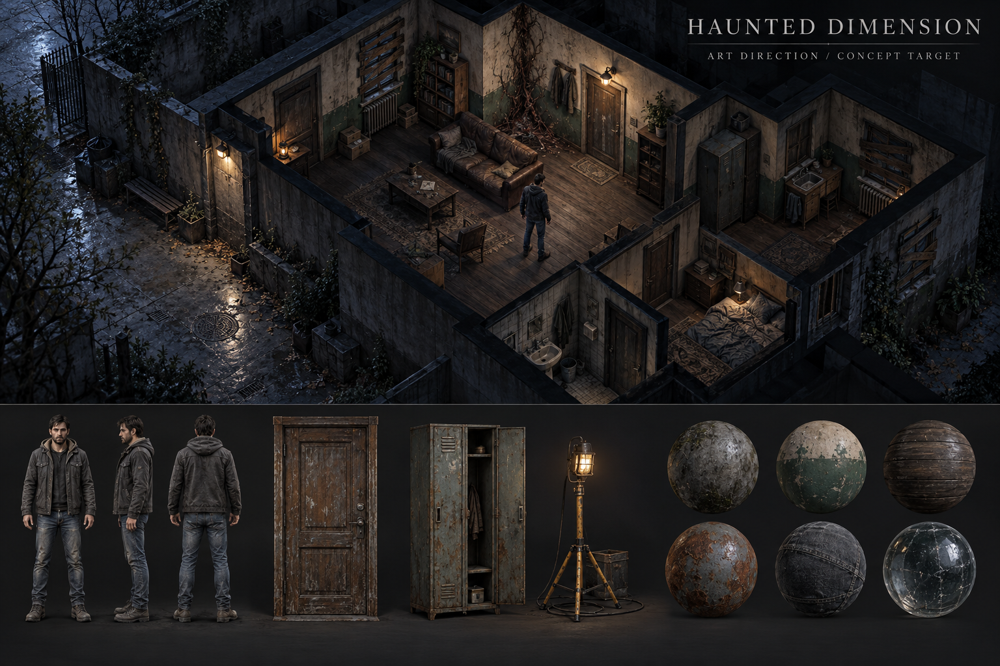
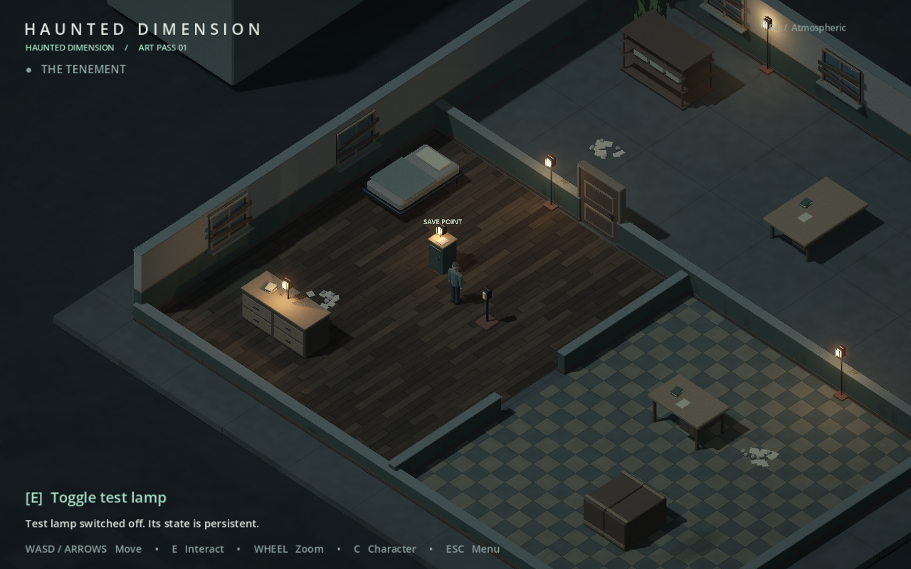

# Haunted Dimension — 3D art direction

**Direction:** familiar places, carefully worn; human-scale silhouettes; cold ambient light interrupted by small practical sources. The world is believable before it is unsettling. Detail describes use, neglect and damage instead of competing with navigation.

This guide governs the cumulative Milestone 2 project and later art production. The playable build now contains an initial implementation of this direction. It is not the final asset fidelity shown by the concept board.

## Visual target

**Concept target.** Generated with the built-in image tool; prompt and provenance are recorded in [CONCEPT_PROMPT.md](CONCEPT_PROMPT.md). It establishes shape, material and lighting relationships, not a literal level layout or a collection of usable 3D meshes.

Warcraft III informs silhouette clarity, authored shape hierarchy and deliberate surface design. How to Survive 2 informs human scale, functional architecture and elevated-camera presentation. Neither supplies characters, assets, textures or code. The resulting direction is original: restrained psychological horror in ordinary spaces, with modern PBR materials and a darker, less fantastical palette.

## Five decisions that keep the art coherent

1. **Silhouette before surface.** A door reads as a door at maximum zoom-out. A jacket, boots and ordinary posture identify a person before face detail is visible. Broaden a thin handle or trim slightly if needed; do not enlarge heads, hands, shoulders or equipment into fantasy proportions.
2. **Every object has a plausible use.** Structural posts meet the ground, lights have fixtures, furniture has supports, and evacuation clutter gathers around believable activity. No random glowing objects to fill empty space.
3. **Weathering follows causes.** Moisture enters below windows and at floor seams; paint chips at corners and hand contact; rust follows exposed metal and runoff. Keep quiet areas between damage patches.
4. **Darkness separates spaces.** The Refuge has warmer pools around practical lights, while the Passage and Courtyard retain cold ambient fill. Never use a black crush to hide an unreadable player or doorway.
5. **Wrongness is scarce.** Most of a room should remain mundane. One unresolved stain, a root-like growth in a damp corner or an oddly empty piece of furniture has more force than covering every wall with occult decoration.

## Palette and value hierarchy

These are surface/UI reference swatches in sRGB, not final lit pixel values. Tune them under the shared lighting rig, never in isolation.

| Role | Swatch | Use |
| --- | --- | --- |
| Charcoal | `#262C2A` | Rubber, boot soles, deep structural accents |
| Aged concrete | `#626860` | Walls, slabs, planters, damaged infrastructure |
| Dirty beige | `#858477` | Plaster and faded institutional interiors |
| Faded green | `#414E43` | Lower wall paint, worn cabinets, doors |
| Dark wood | `#514335` | Frames, boards, furniture |
| Worn steel | `#424B4D` | Fixtures, lockers, frames and functional hardware |
| Rust / dried red-brown | `#624437` | Oxidation; a separate darker blood material for future content |
| Muted blue-grey | `#343D45` | Denim and cold secondary shapes |
| Dusty olive | `#4B5940` | Stressed vegetation; no luminous foliage |
| Practical amber | `#EFBA7C` | Warm artificial light, localized rather than painted across everything |

Keep most surfaces low-to-medium saturation. Reserve the brightest values for a small number of practical bulbs and useful highlights. A door leaf should separate from its frame and wall in greyscale. Use pale worn edges and a recognizable silhouette, not an emissive outline, to make an interactable readable.

## Camera and composition

Preserve the existing orthographic camera, its fixed yaw/pitch, smooth follow and size range 10–28. Review every asset at **10, 19 and 28** camera size; 19 is the normal working view.

- Route widths and collision remain gameplay contracts. Dress the margins before adding objects in the walking lane.
- Entrances receive clear jambs, a threshold and a contrast change. Cutaway walls must retain their existing physical collision; art occluders may cover only visible geometry.
- Keep most clutter below knee height or against room edges. Avoid bright paper piles that compete with the player.
- Read a character as head → shoulders → torso → separated legs; small features cannot carry identity alone.
- When roof/floor visibility is expanded later, hide the visual obstruction without changing collision, navigation or save data.
- Do not use depth of field, heavy grain, chromatic aberration or temporal smear to create atmosphere. They destroy information at this camera distance.

## Environment kit

Use metre-scale modules on a 0.25 m assembly grid, with 1 m and 2 m wall segments as production defaults. Typical future human-scale doors should be about 0.9–1.1 m wide and 2.0–2.2 m tall. Existing test-area openings/colliders are preserved in this pass; production dimensions should be applied to new content rather than silently changing saved spaces.

Build a small common vocabulary: plaster wall, painted lower wall, skirting, coping, door/jamb, window/sill, boarded variant, metal service frame and a few reusable furniture families. Add variation through material masks, restrained rotation and damage, not dozens of almost-identical meshes.

| Setting | Dominant vocabulary | Horror treatment |
| --- | --- | --- |
| Houses / apartments / shops | Wood, plaster, fabric, glass, practical belongings | Half-cleared rooms, dust interruptions, moisture, isolated damaged fixtures |
| Police / hospital spaces | Faded paint, worn linoleum/tile, steel, institutional signs | Cold corridors, abandoned papers, uneven practical lighting |
| Industry / warehouses | Concrete, painted metal, rust, timber pallets | Water tracks, sagging utility lines, blocked secondary spaces |
| Roads / ruined infrastructure | Asphalt, stained concrete, weathered barriers | Sparse debris trails and unlit stretches; navigable route remains clear |
| Forests / exterior margins | Soil, stressed vegetation, dead wood | Clustered overgrowth and unfamiliar negative space; avoid uniformly dense foliage |
| Underground spaces | Damp concrete, mineral staining, oxidized steel | Local light pools, occluded side passages and restrained humidity haze |

The quality upgrade dresses the Tenement and Courtyard and their non-traversable suburban surroundings. The reusable scenery kit includes houses, market/pharmacy/police/school/service façades, pitched roofs, porches, gutters, shaped sedans, branching trees and curved street edges. This adds visual context without adding playable neighborhoods or story locations.

## PBR surface rules

Use metallic/roughness PBR. Treat base color as unlit reflectance: no painted directional shadows, bloom or specular highlights. Handcrafted quality comes from broad variation, edge wear and selected directional marks. Maintain correct sRGB/linear interpretation: the floor shader converts authored colors to linear light so floors match StandardMaterial3D props.

| Surface | Roughness target | Metallic | Shape / surface cue |
| --- | --- | --- | --- |
| Dry concrete | 0.80–0.98 | 0 | Broad mottling, restrained porous normal, chipped major edges |
| Damp concrete | 0.25–0.55 in wet patches | 0 | Darkened albedo and smoother normals only where wet |
| Wood | 0.60–0.85 | 0 | Grain follows the board, exposed ends and worn contact edges |
| Painted metal | 0.45–0.80 | 0 on paint | Bare steel is exposed selectively; paint itself is not metal |
| Bare worn metal | 0.35–0.65 | 0.7–1 | Muted, controlled highlights, clear large folds/edges |
| Rust | 0.85–1.0 | 0 | Matte oxide; broad red-brown variation, never orange glitter |
| Soil / dust | 0.90–1.0 | 0 | Low contrast, broad breakup; no glittering speckle |
| Fabric | 0.85–1.0 | 0 | Folds define form; weave is subordinate |
| Glass | 0.10–0.35 | 0 | Readable pane/frame separation and selective dirt; avoid mirror walls |
| Skin | 0.50–0.75 | 0 | Subtle warm/cool variation; no shiny plastic finish |
| Dried blood | 0.70–0.95 | 0 | Dark brown-red, sparse and localized; future content, not placed in this pass |
| Vegetation | 0.80–0.95 | 0 | Muted foliage clusters; readable mass before leaf detail |

Current procedural surfaces share 512 px seamless normal/tone maps over a 2 m repeat: **256 texels/metre**. Normal strength is intentionally low. The floor shader provides board/tile joints, material-dependent color, normal mapping and a wetness mask that darkens/smooths only selected areas. It is a material parameter, not a weather system.

Production target: 256 px/m for large modular backgrounds; 512 px/m for frequently approached props; a 2K character set and up to 1K for a small hero prop if the camera test justifies it. Use shared trim sheets/atlases for compatible objects. Pack AO/roughness/metallic consistently, bake normals from useful bevels/folds and keep a separate clean lightmap UV set when baking. Normal maps use Godot's expected OpenGL-style orientation. Vertex masks may blend clean/damaged/wet variants without adding new material slots.

Mesh decals currently supply irregular dirt/stain patches without extra collision. Final authored decal atlases should add chipped paint, damp marks, dirt and selective damage; blood remains content-driven. Avoid piling transparent layers across the entire floor.

## Lighting, shadows and atmosphere

The current desktop presentation uses **Forward+** for SSAO and sparse volumetric haze. A Compatibility launch remains available with those unsupported effects disabled. Godot documents the renderer differences in its [rendering overview](https://docs.godotengine.org/en/stable/tutorials/rendering/renderers.html).

- Use a cold, low-energy moon key and subdued ambient fill. Warm sources must have a visible fixture and plausible falloff. Do not fill every corner with a light.
- The player silhouette and path edges should remain distinguishable even with the nearest test lamp off. Deep pockets are allowed at room margins, not across every interaction route.
- One directional shadow source; give local shadows only to a few important practical lamps. The first pass uses a 4096 directional map and 2048 positional atlas. Performance mode removes optional local shadow casting.
- Keep fog sparse. It should separate distant forms, not make each room look full of smoke. The first pass uses a low density; it does not add dramatic light shafts everywhere.
- Use AO to anchor corners and furniture, not to outline everything in black. Restrained filmic tone mapping, mild desaturation and a soft vignette complete the pass. Bloom is limited to sufficiently bright practical sources.
- No baked GI is included yet. For production interiors, bake static indirect light after layout approval; retain dynamic direct light on the player, doors and key fixtures. Do not claim a bake while layouts remain procedural test content.

PBR conventions and the normal/triplanar material features are documented in Godot's [StandardMaterial3D reference](https://docs.godotengine.org/en/stable/tutorials/3d/standard_material_3d.html). Engine-level effects are detailed in the [Environment reference](https://docs.godotengine.org/en/stable/classes/class_environment.html).

## Humans and future creatures

Ordinary adults retain realistic overall proportions: modest head size, narrow wrists/ankles, familiar clothing layers, practical shoes and relaxed posture. Jacket seams, cuff folds and trouser volume carry the first-pass character. Face detail is secondary. The current procedural human has a presentation-only walk cycle and uses the unchanged player controller/capsule. It is a block-in for later skinned production art, not a finished hero character.

For future monsters, start with recognizable human mass and change **one primary anatomical relationship**: limb length, joint direction, shoulder height or head carriage. Add limited asymmetry and weight-bearing plausibility. At long range, some should read almost human; at normal play distance, posture and negative space should reveal the difference. Keep coloration within bruised skin, desaturated flesh, dirty cloth and dried brown-red. Avoid bright emissive armor, colorful magic, large decorative horns or cybernetic ornament. Movement and sound will carry much of the horror in their own future milestones. No enemy, monster, AI or combat system is introduced here.

## Production budgets and import standards

These are starting budgets to validate through profiling, not proof that a future semi-open world already meets them.

| Asset | Suggested LOD0 triangles | LOD approach | Material slots |
| --- | --- | --- | --- |
| Ordinary human | 15k–30k | ~50% / 20% plus distant simplification | 2–3 |
| Major furniture / door | 1k–5k | ~40% / 15%, preserve silhouette and entrance edges | 1–2 |
| Wall / floor module | 100–1.5k | Remove bevels and small trim first | 1–2 |
| Small clutter | 50–500 | Batch, then cull when sub-pixel | 1 shared |
| Vegetation cluster | 100–1k | Instanced clusters, restrained alpha overdraw | 1 shared |

The quality upgrade removes simple-box visual substitutions. F4 Performance or camera size ≥24 hides secondary clutter while preserving bevels, upholstered curves, car bodywork and tree silhouettes. Leaf sprays use MultiMesh instancing, and full visible walls provide occluders. Do not generate occluders for invisible cutaway wall height. Future GLB assets should use silhouette-preserving imported geometry LODs and screen-coverage thresholds.

Export meshes with applied scale, metre units, clean normals, deliberate UV seams, stable names and a sensible pivot: floor centre for furniture, hinge for doors, ground/root for characters. Store render meshes separately from simple gameplay colliders. Validate UVs, tangents, material color spaces, LOD silhouette and collision before importing the asset into a populated level.

Aim for a 16.7 ms frame at the agreed target resolution/hardware; measure full scenes and camera motion, not just an asset viewer. The current benchmark is a short automated viewport test on an RTX 3060 Laptop GPU, not a streaming-world stress test. Record draw calls, triangles and frame times for both profiles. See [verification](VERIFICATION.md) for measured results and limits.

## First playable pass and acceptance

**Actual gameplay capture.** The concept board above has richer authored texture and model detail; it remains the production target. This first pass implements its palette, readable material families, furniture silhouettes, light hierarchy and restrained wear within the existing test layout.

Implemented: plaster/paint/skirting/coping, boarded windows, doors with panel/handle details and an open visual, cot, sideboard, desk/table, crates, shelving, benches, concrete planter, service cabinet, work lamps, damp surfaces, papers/rubble, sparse vegetation and localized root-like corruption. SavePoint retains its name, role and authorization; its cabinet/work-light visual is provisional.

Acceptance checklist for every later asset:

- Readable at 10/19/28 camera size; materials do not shimmer or collapse into noisy pixels.
- Functional proportions, stable silhouette, plausible wear and grounded material response.
- Player, entrance and nearest interactable remain identifiable with the local lamp off.
- No new visual mesh silently changes collision, navigation, profession state or saves.
- No accidental neon, broad bloom, glossy plastic, black clipping or persistent visual clutter across routes.
- Profiler results are recorded for the actual hardware/resolution; LOD/culling preserves the useful shape.
- Existing Milestone 1/2 regression suites pass before replacing the standalone build.

Remaining production work: authored hero meshes and texture atlases, full skinned animation, richer hand-painted damage masks, baked indirect lighting after layout lock, dynamic roof/floor visibility for larger buildings, and large-area streaming/performance tests. These are future art tasks, not hidden claims about this pass.
