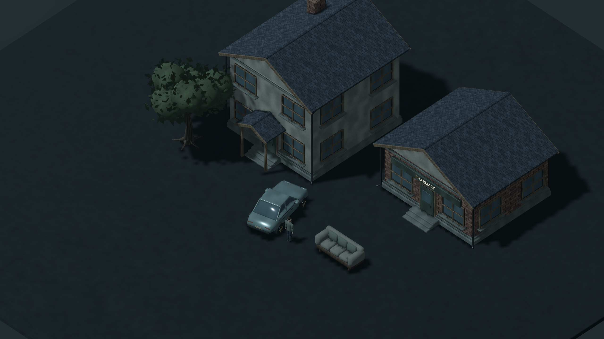
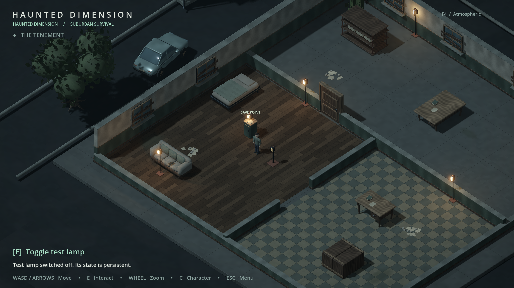

# Isometric visual quality upgrade — 2026-09-15

The camera remains elevated orthographic; all changed assets are normal 3D geometry. Existing level IDs, collision envelopes, controller, interaction, progression and save schema are preserved.

- `art/meshes/suburban_assets.gd`: shaped sedan bodywork with sloped glazing, wheels, trim and mirrors; pitched-roof architecture with gables, windows, steps, porches and gutters; branching trees with instanced leaf sprays; road and kerb ribbons.
- `art/meshes/art_meshes.gd`: curved cuboids, smooth ring profiles, tapered branch tubes and deterministic irregular organic surfaces. Performance mode retains bevelled silhouettes.
- `art/meshes/art_props.gd`: upholstered three-seat sofa, rounded mattress/pillow, shaped supports and bench armrests. The sofa uses the old sideboard's unchanged collision envelope.
- `actors/player/human_visual.gd`: human-scale clothing and head forms, hands/thumbs, knees and elbows with a presentation-only joint walk cycle.
- `art/materials/textures`: 30 original seamless maps across ten surface families, including albedo, normal and packed AO/roughness. `bake_surfaces.py` is a repeatable offline authoring tool, never a runtime dependency.
- `data/*_art.json`: scenery placements, separated from persistent level contracts. Cold fill is increased slightly to retain shadow detail; warm practical lights and existing shadow/AO/fog controls remain.

## Validation

Full visual regression suite: 330 checks passed (109 foundation, 133 progression, 22 art, 11 asset, 44 fullscreen, 3 save-seed, 8 fresh-process load). The suite covers movement, physics, camera, interaction, transitions, paused menus, all save slots, malformed saves, migrations, progression and fullscreen resolution coverage.

Rendered review includes normal/close/wide gameplay views, both quality profiles and a separate asset inspection scene. Native desktop: 2560×1440; fullscreen render tests also include 1920×1080, 3840×2160, 1280×1024 and 3440×1440. Test files are isolated from real saves.

## Scope

This is an original procedural asset upgrade, not imported third-party production art. Surrounding civic buildings, cars, street bends and tree groups are scenery, not new enterable locations. The two existing playable layouts remain intact. A fully skinned character, individually authored hero assets, dynamic roof hiding and a large traversable suburban map remain future work. No combat, enemies, inventory or quests were added.
